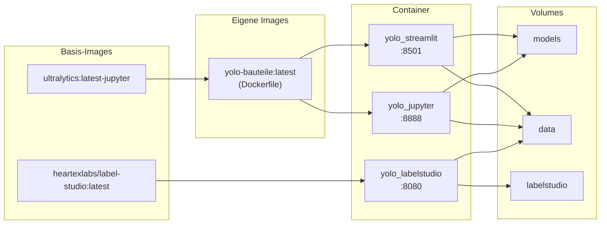

# YOLO Bauteile – Projektübersicht

Erkennung und Zählung elektronischer Bauteile mit **Ultralytics YOLO11**,
betrieben als vollständig containerisierte Anwendung (Docker).

## Inhalt

| Datei / Ordner | Beschreibung |
|---|---|
| `yolo_bauteile_app.py` | Streamlit-Web-App zur Live-Inferenz |
| `nb0_bilder_vorbereiten_11.ipynb` | Bilder sichten und vorbereiten |
| `nb0b_bilder_skalieren.ipynb` | Bilder skalieren |
| `nb1_daten_vorbereiten_23.ipynb` | Datensatz für Training aufbereiten |
| `nb2_yolo11_training_colab_1.ipynb` | Training (Colab-kompatibel) |
| `Dockerfile` | Container-Build (gemeinsames Image) |
| `docker-compose.yml` | Orchestrierung (Streamlit + Jupyter + Label Studio) |

---

## Verwendete Basis-Images

| Image | Verwendung |
|---|---|
| [`ultralytics/ultralytics:latest-jupyter`](https://hub.docker.com/r/ultralytics/ultralytics) | Basis für `yolo-bauteile:latest` (Streamlit + Jupyter) |
| [`heartexlabs/label-studio:latest`](https://hub.docker.com/r/heartexlabs/label-studio) | Label Studio (direkt verwendet, kein eigener Build) |

---

## Architektur

Streamlit und Jupyter verwenden **dasselbe Docker-Image** (`yolo-bauteile:latest`),
das aus dem `Dockerfile` gebaut wird. Basis ist `ultralytics/ultralytics:latest-jupyter`
(PyTorch CPU, Ultralytics, OpenCV, Jupyter – bereits enthalten), Streamlit wird
zusätzlich installiert. Label Studio läuft als separates fertiges Image.



Die Volumes `models` und `data` sind in allen Containern eingebunden:
- In Jupyter trainierte Modelle sind sofort in der Streamlit-App verfügbar
- In Label Studio annotierte Bilder liegen im selben `data`-Volume

---

## Voraussetzungen

- [Docker Desktop](https://www.docker.com/products/docker-desktop/) (Windows / macOS / Linux)

> GPU-Unterstützung ist **nicht** konfiguriert. Das Image verwendet PyTorch CPU.

---

## Schnellstart

```bash
# Image einmalig bauen und beide Dienste starten
docker compose up --build

# Im Hintergrund starten
docker compose up --build -d
```

| Dienst | URL |
|---|---|
| Streamlit App | http://localhost:8501 |
| JupyterLab | http://localhost:8888 |
| Label Studio | http://localhost:8080 |

---

## Notebooks

Die Notebooks liegen im Container unter `/workspace/Notebooks/`
und werden direkt aus dem Projektordner gemountet (Änderungen werden
sofort auf dem Host gespeichert).

| Notebook | Inhalt |
|---|---|
| `nb0_bilder_vorbereiten_11.ipynb` | Bilder sichten und vorbereiten |
| `nb0b_bilder_skalieren.ipynb` | Bilder skalieren |
| `nb1_daten_vorbereiten_23.ipynb` | Datensatz für Training aufbereiten |
| `nb2_yolo11_training_colab_1.ipynb` | YOLO11-Training |

---

## Modell einbinden

Das trainierte Modell (`.pt`-Datei) liegt im Volume `models` und ist
für beide Dienste unter `/workspace/models/` erreichbar.

```bash
# Modell in das Volume kopieren (Container muss laufen)
docker cp best.pt yolo_streamlit:/workspace/models/best.pt
```

In der Streamlit-App den Pfad `/workspace/models/best.pt` eingeben.

---

## Label Studio

Bilder annotieren unter **http://localhost:8080**.
Nach dem Login ein neues Projekt anlegen und als Dateiquülle
`/label-studio/files` angeben – das ist dasselbe `data`-Volume
wie in Jupyter und Streamlit.

```bash
# Bilder ins data-Volume kopieren
docker cp ./meine_bilder yolo_labelstudio:/label-studio/files/meine_bilder
```

---

## Volumes

Docker-Volumes werden von Docker Desktop in der WSL2-VM verwaltet und
sind **nicht** als normaler Windows-Ordner sichtbar. Zugriff über den
Windows Explorer:

```
\\wsl.localhost\docker-desktop-data\data\docker\volumes\yolo_models\_data
\\wsl.localhost\docker-desktop-data\data\docker\volumes\yolo_data\_data
\\wsl.localhost\docker-desktop-data\data\docker\volumes\yolo_labelstudio\_data
```

Alternativ lassen sich Dateien per `docker cp` kopieren:

```bash
# Datei aus Volume holen
docker cp yolo_jupyter:/workspace/models/best.pt ./best.pt

# Datei ins Volume legen
docker cp ./best.pt yolo_jupyter:/workspace/models/best.pt
```

---

## Datensätze einbinden

Bilder und Datensätze liegen im Volume `data`, eingebunden unter
`/workspace/data/`.

```bash
# Ordner in das Volume kopieren
docker cp ./mein_datensatz yolo_jupyter:/workspace/data/mein_datensatz
```

---

## Einzelne Dienste steuern

```bash
# Nur Streamlit starten
docker compose up streamlit

# Nur Jupyter starten
docker compose up jupyter

# Nur Label Studio starten
docker compose up labelstudio

# Alle Dienste stoppen
docker compose down

# Volumes ebenfalls löschen (Achtung: Modelle und Daten gehen verloren)
docker compose down -v
```

---
